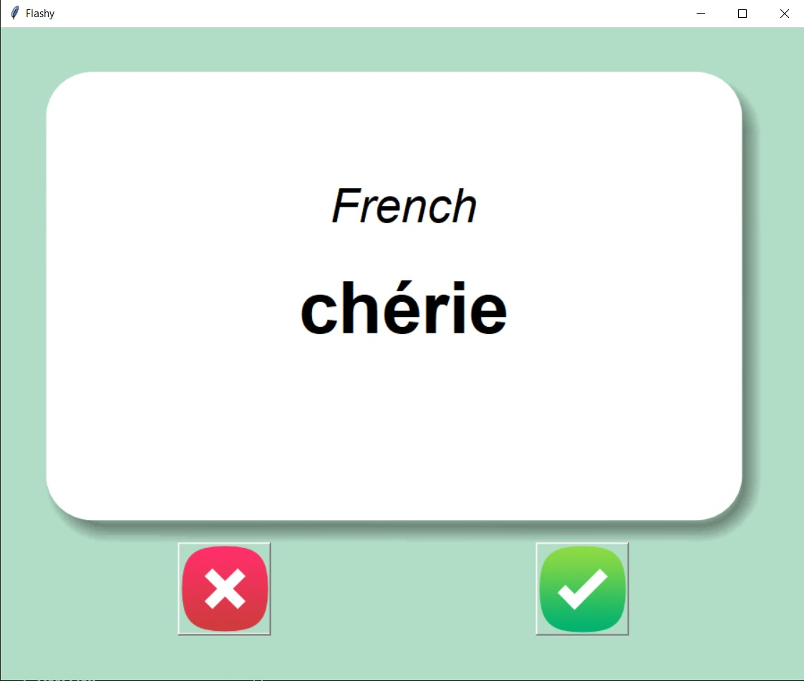
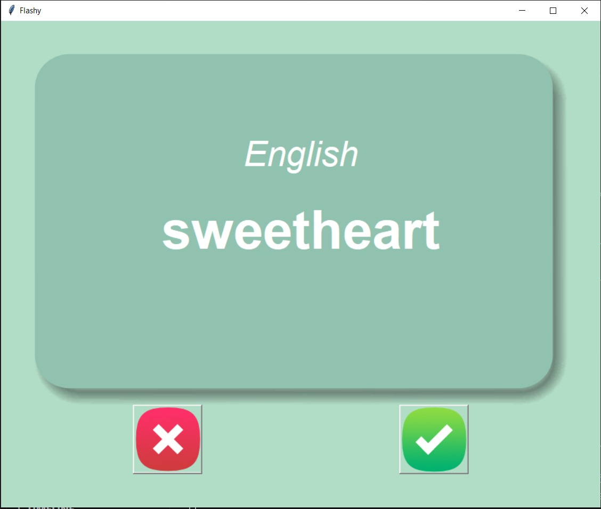

# 🧠 Flashcard App - Python Tkinter Project

The **Flashcard App** is a simple yet effective tool built with Python and Tkinter that helps users learn new vocabulary through digital flashcards. Designed for language learning, this app displays a word in one language and flips the card after a few seconds to show its translation. Ideal for quick, focused study sessions.

---

## 🚀 Features

- 🃏 Displays random flashcards from a dataset (e.g., French → English)
- ⏱️ Automatically flips the card after a timed delay
- 🔁 “Next” button to skip to a new card
- ✅ Tracks learned words and saves progress
- 📁 Stores updated vocabulary list in a CSV file
- 🎨 Visually appealing flashcard UI with background images and text styling

---

## 🛠️ Technologies Used

- Python 3.13.3
- Tkinter for GUI
- Pandas for data handling
- CSV for vocabulary dataset
- `random` and `after()` for timed functionality

---

## 📚 Concepts Covered

- GUI development using Tkinter
- CSV file reading/writing with pandas
- Randomized selection from a list
- Timer-based events with `after()`
- File persistence for progress tracking
- Event-driven programming and state management

---

## 📷 Preview

--

---

## ✅ Possible Improvements

- Add support for multiple languages
- Allow user input to mark words as "learned"
- Add sound or pronunciation support
- Create user accounts to save individual progress
- Gamify learning with scoring and levels

---

## 👤 Author

**Priyanshu Singh**  
GitHub: [priyan17singh](https://github.com/priyan17singh)

---

Feel free to fork this project, contribute new features, or use it to build your own custom flashcard tool!

