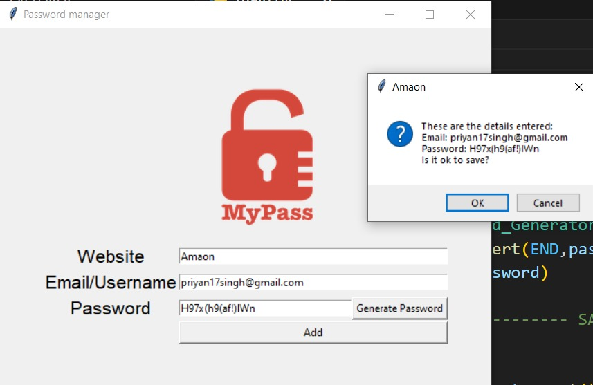

# 🔐 Password Manager - Python Tkinter Project

The **Password Manager** is a secure and simple tool developed using Python and Tkinter to help users store and manage their login credentials. It allows users to generate strong passwords, save them securely, and retrieve credentials when needed — all through a friendly graphical interface.

---

## 🚀 Features

- 🔑 Generate strong, random passwords
- 💾 Save credentials (website, username, password) to a local file
- 🔍 Search and retrieve stored credentials by website name
- 🧾 Automatically copies generated password to clipboard
- 🖥️ Easy-to-use GUI built with Tkinter
- ✅ Validates input fields before saving
- 🔐 Local data storage in a `.json` file for persistent access

---

## 🛠️ Technologies Used

- Python 3.13.3
- Tkinter (GUI)
- JSON (for data storage)
- `random`, `string`, `pyperclip` (for password generation and clipboard functionality)

---

## 📚 Concepts Covered

- GUI development using Tkinter
- File handling and JSON data management
- Clipboard interaction with `pyperclip`
- Random secure password generation
- Input validation and error handling
- Modular code structure with functions

---

## 📷 Preview

---

## ✅ Possible Improvements

- Encrypt the stored passwords for added security
- Add master password authentication
- Export credentials to CSV
- Implement cloud sync or backup option
- Add password strength meter

---

## 👤 Author

**Priyanshu Singh**  
GitHub: [priyan17singh](https://github.com/priyan17singh)

---

Feel free to fork this project, contribute ideas, or build your own advanced version!

